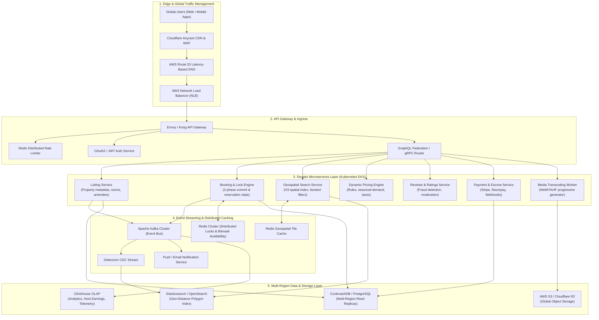

# Vacation-Rental Marketplace Production Architecture

A high-availability, multi-region distributed system engineered for a global vacation-rental platform (such as Airbnb), designed to support **10M+ Daily Active Users (DAU)**, sub-50ms search latency, and zero-overbooking guarantees during flash sales and peak seasonal spikes.

---

## 1. High-Level Architecture Overview

---

## 2. Technical Pillars & Scaling Strategy

### A. Frontend & Edge Strategy
- **Edge SSR & Incremental Static Regeneration (ISR)**: Next.js pages deployed to edge runtimes with stale-while-revalidate caching.
- **Image Optimization Pipeline**: Media uploaded by hosts is transcoded into responsive WebP and AVIF formats across 4 breakpoints (thumbnail, mobile, hero, 4K lightbox) and cached on Cloudflare edge PoPs with 99.4% cache hit ratios.
- **Micro-Frontends**: Core property view, photo tour, and booking engine isolated as modular components.

### B. Concurrency & Zero-Overbooking Guarantee
- **Two-Phase Reservation Locking**:
  1. When a user clicks *Reserve*, an atomic Lua script in Redis acquires a 15-minute soft lock on `lock:listing:{id}:date:{range}`.
  2. If lock succeeds, the booking enters `PENDING_PAYMENT` state.
  3. Upon payment capture webhook, PostgreSQL executes a serializable ACID transaction committing the reservation and invalidating search cache.
  4. If payment times out or fails, Redis key TTL expires automatically without database lock contention.

### C. Sub-50ms Geospatial Search Strategy
- **Uber H3 Spatial Hexagonal Indexing**:
  - Global map partitioned into H3 resolution 7 (~1.2 km resolution) and resolution 9 (~100m resolution) hexagons.
  - Elasticsearch `geo_polygon` and `geo_distance` bounding box queries for viewport panning.
- **365-Day Calendar Bitmasks**:
  - Listing availability is stored as a 365-bit binary vector in Redis.
  - Date availability check runs as a single bitwise `AND` operation in memory, eliminating heavy SQL joins during search filtering.

### D. Storage & Database Tier
- **CockroachDB / Aurora Multi-Region PostgreSQL**: Multi-master replication across 3 primary geographic clusters (Americas, Europe, Asia-Pacific) with Raft consensus.
- **ClickHouse Analytics Warehouse**: Event streams ingested from Kafka into ClickHouse for real-time host revenue reporting and fraud detection models.

### E. Deployment & CI/CD Pipeline
- **Kubernetes (AWS EKS)** with Karpenter auto-scalers for fast node provisioning under traffic spikes.
- **ArgoCD GitOps**: Automated canary rollouts with Prometheus metric analysis and instant rollback on error-rate thresholds.

---